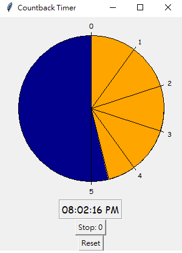

# visual_python_timer

## READ ME 
- This is a very simple visual countback timer using python Tkinter
- If anyone needs other features, please let me know.
  Thanks!

- Demo Image:

------------------------
- If need shortcuts, 
  i might implement it in future versions

- contact: 
e- mail: jamebozo@gmail.com 

------------------------
Special Thanks to Chatgpt. 
